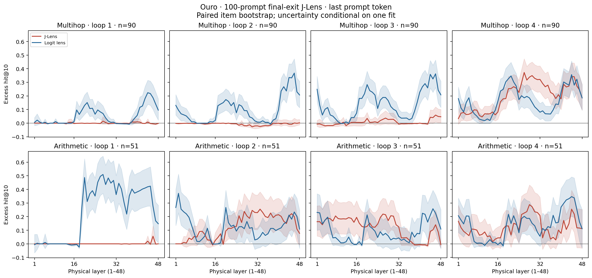
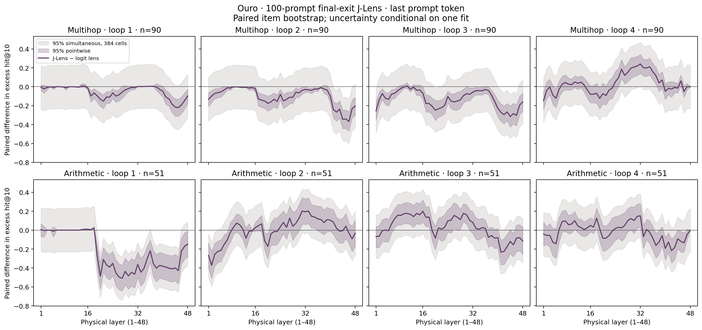
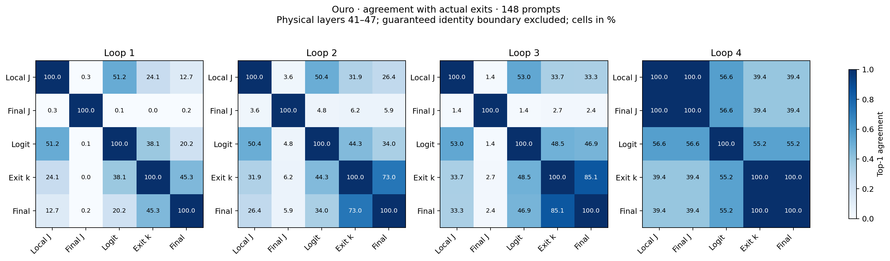
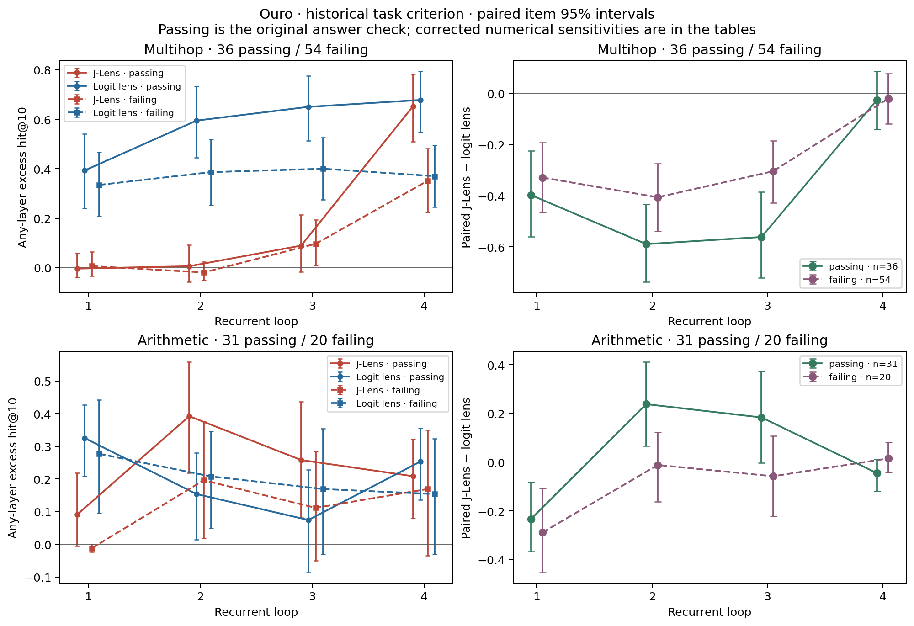

# Reading Ouro after the application

7 September 2026. This follow-up was done after submission; the application and its artifacts are unchanged.

**J-Lens still loses on the clearest comparison: multihop readout in Ouro's first three loops. The full depth curves show that this is not merely an artifact of letting the logit lens choose a late layer.** There is a favorable region in the final pass, and arithmetic remains mixed. Comparing the exit lenses with actual model outputs also changes the interpretation: their near-total disagreement substantially overstates the model's recurrent revision.

The question was whether J-Lens reveals task-defined intermediate content that ordinary unembedding misses while Ouro repeatedly processes its hidden state. When computation happens between tokens, hidden-state readouts could complement monitoring the visible reasoning trace. No monitoring system, or comparison with chain-of-thought monitoring, was tested here.

The submitted result reproduces independently from the saved ranks:

| J-Lens minus logit lens, excess hit@10 | Loop 1 | Loop 2 | Loop 3 | Loop 4 |
|---|---:|---:|---:|---:|
| Multihop, 90 items | −.356 [−.463, −.249] | −.479 [−.579, −.377] | −.407 [−.510, −.304] | −.022 [−.096, .056] |
| Arithmetic, 51 items | −.255 [−.362, −.139] | .140 [.020, .264] | .089 [−.045, .226] | −.021 [−.072, .024] |

This is the original **any-layer** score: each true name and each control separately gets 48 opportunities to enter the vocabulary top ten. Controls are averaged afterward, then labels within each item, then items. It is an oracle coverage statistic, not a layer-selection rule validated on held-out prompts. The 90 multihop items contain 100 eligible labels; arithmetic contains 51 numeric labels. “Intermediate” denotes the task annotation, not demonstrated causal use. All intervals above use 20,000 paired item-bootstrap draws and are unadjusted across the eight comparisons.

The new analyses preserve that metric and its population. Fixed-layer curves remove the oracle maximum. Their uncertainty conditions on one 100-prompt fitted lens; it excludes fit-to-fit variation. Alongside pointwise intervals, I calculated an approximate simultaneous band across all 384 task × loop × layer contrasts and a dependence sensitivity that resamples shared-concept groups while preserving item weights. There are 64 multihop and 14 arithmetic groups. These curated prompts have no uniquely correct independence assumption.

**The depth profile.** In multihop loops 1–3, the disadvantage appears in both the middle and the end of the physical stack. Averaging the predeclared middle band, layers 17–32, gives differences of −.071 [−.112, −.035], −.114 [−.163, −.070], and −.154 [−.215, −.095]. Shared-concept intervals also exclude zero. Loop 2's mean difference is negative at every physical layer. Thus the early multihop loss survives asking where each lens works.

Loop 4 is the qualification. Its clearest positive region is layers 26–37, whose pointwise intervals exclude zero. At the largest observed difference, layer 32, mean within-item recovery is .333 for J-Lens versus .089 for the logit lens; control rates are .012 and .009. The paired excess difference is +.241, pointwise interval [.142, .341]. This cell barely clears the simultaneous item-bootstrap band, but none of the positive cells clears the simultaneous shared-concept band. The predeclared final third, layers 33–48, averages +.056 [.014, .102], with shared-concept interval [.012, .103]; these block intervals are unadjusted. This is evidence of a localized final-pass advantage worth replicating, not a general early-depth advantage.

The relative effect also changes with depth: the fitted full-stack linear slopes in multihop are −.118, −.178, −.131 and +.123 across loops; all four pointwise item and shared-concept intervals exclude zero. These describe curve shape, not a mechanism. Arithmetic has positive regions in loops 2 and 3. Loop 3's first third averages +.098 [.014, .187], whereas its final third averages −.088 [−.155, −.025]. No positive arithmetic cell survives the 384-cell simultaneous item band. Full means, control rates, intervals and slopes are in [the layer tables](results/layerwise.json); the [loop × layer heatmap](results/loop_layer_heatmap.png) keeps recurrence visible. Merging control aliases, excluding two outdated factual items, and resampling prompt-name families preserve the early multihop deficit and final-pass shape. The first two checks change layer effects by at most .022 and .012. [Bounded sensitivities](audit/sensitivities.md).

**Actual exits resolve the disagreement question.** I used each local all-exit run's own native loop-end predictions, with 148 prompts, and averaged each prompt's agreements across layers before bootstrapping prompts. Layers 41–47 exclude the layer-48 boundary where local J-Lens and the logit lens agree with the exit by construction. The historical 41–48 window is retained in the tables.

| Top-1 agreement, % | Loop 1 | Loop 2 | Loop 3 | Loop 4 |
|---|---:|---:|---:|---:|
| Actual current exit with actual final exit | 45.3 | 73.0 | 85.1 | 100 |
| Local J-Lens with actual current exit, layers 41–47 | 24.1 | 31.9 | 33.7 | 39.4 |
| Final J-Lens with actual current exit | 0.0 | 6.2 | 2.7 | 39.4 |
| Logit lens with actual current exit | 38.1 | 44.3 | 48.5 | 55.2 |
| Local J-Lens with final J-Lens | 0.3 | 3.6 | 1.4 | 100 |

At loop 3, actual exits agree 85.1% [79.1%, 90.5%]; the two lenses agree 1.45% [.58%, 2.51%]. Actual KL(exit 3 || final) is .086 [.066, .107] nats. Against the **final** prediction, final J-Lens agrees 2.4%, versus 46.9% for the logit lens: paired difference −44.5 [−51.2, −37.8] percentage points. Top-ten recall of that actual final token is .347 versus .745, paired difference −.399 [−.473, −.322]. One token earlier, actual loop-3/final agreement rises to 96.6%, while lens-to-lens agreement remains .39%. Native next-token predictions do change, but the enormous lens gap cannot be treated as the amount of model revision. [Independent paired checks](probe/VERIFY_MAIN_FOLLOWUP.md).

Final-exit J-Lens is a poor predictor of actual exits in these early passes. This does **not** identify numerical conditioning as the cause, or by itself refute J-Lens: Anthropic explicitly reports poor next-token prediction, and defines the lens through averaged verbalizability. Its intermediate-recovery benchmark also uses any-layer recovery. The distinction between these two objectives is essential. [J-Lens quantitative comparisons](https://transformer-circuits.pub/2026/workspace/index.html#app-quant).

The [complete exit tables](results/exit_diagnostics.csv) include available actual-token hit@10/hit@100, reciprocal ranks and KL, and the [actual-exit matrices](results/actual_exit_agreement.png) show both positions. Full vocabulary distributions/top-k sets were not retained, so set-overlap metrics cannot be reconstructed. Misleadingly named `local` fields for the final lens and logit lens actually refer to the final target; unavailable current-exit rank/KL comparisons are left empty.

**Passing and failing trajectories.** The historical criterion gives 72/148 passes. Among eligible items, the groups are 36 passing/54 failing multihop and 31/20 arithmetic. The early multihop deficit persists in both groups: at loop 2 it is −.589 [−.737, −.433] among passes and −.406 [−.538, −.274] among failures. Restricting attention to successful continuations therefore does not remove it.

Both lenses read more labelled multihop content on passing items in loop 4: passing-minus-failing excess is +.302 [.109, .487] for J-Lens and +.308 [.131, .481] for the logit lens. A larger loop-3 J-Lens deficit among passes has interaction −.257 [−.458, −.046], also negative under shared-concept resampling. It is an exploratory, unadjusted association; task composition can explain it. The apparent arithmetic loop-2 interaction is less stable: +.250 [.028, .478], but its shared-concept interval includes zero, as does its interval under the narrow numeric-equivalence criterion. There is no robust general success-specific J-Lens advantage.

The answer matcher still accepts `3.8` and `3.75` for target `3`. Rejecting attached numeric continuations reduces passes to 70; additionally accepting `20` for the target word `twenty` gives 71. Both sensitivities preserve the early multihop deficit. These remain task-criterion labels: four-token continuations and lexical matching do not establish ultimate semantic correctness. All three definitions and subgroup intervals are in [the correctness results](results/correctness.json), with [full subgroup depth curves](results/correctness_layerwise_difference.png).

**The supervised probe.** Loop-1 held-out accuracy reproduces as .594 versus .764 for the logit lens: paired difference −.170 [−.295, −.049], resampling 39 unordered operand pairs. Each classifier actually trains on 512–528 prompts from only 36 pairs, in 2,048 dimensions; 576 is the common evaluation denominator. All five selected classifiers reproduce exactly and attain perfect training accuracy. Matching token forms and the layer-selection validation set leaves a deficit of −.142 [−.279, −.007]. Tighter solver tolerance improves the probe to .611; one extra regularization value barely helps. Increasing training from 18 to 36 class-covering pairs gains .039 [−.029, .109], which is inconclusive. Data limitation is plausible, not established as the explanation.

The native head already supplies a useful linear readout on these features, so the learned probe's loss is not evidence that linear information is absent. Also, the probe **wins in loop 3**, .356 versus .179, difference +.177 [.059, .294]. Probe intervals are pointwise and conditional on the fitted classifiers and selected layers. This is a separate arithmetic task and candidate-set accuracy metric; its older J-Lens fit has incomplete provenance. [Probe checks, predictions and layer curves](probe/probe_audit.md).

**Huginn and the remaining explanation.** Ouro applies weighted next-token losses at recurrent pass boundaries through a shared output head, making strong native-head readout plausible; it does not supervise every physical block. That causal explanation remains untested. [Ouro training objective](https://arxiv.org/html/2510.25741v2#S3.SS1).

The Huginn prior is real but block-specific: in the published arithmetic probe, raw unembedding poorly reads the fourth recurrent block, while its trained coda reads it well. Numeric-prefix readability is not the present concept-recovery metric. Huginn trains its coda after randomly sampled depths, so “no intermediate supervision” is too broad. [Original probing result](https://arxiv.org/html/2507.02199v1#S3.SS2), [original training procedure](https://arxiv.org/html/2502.05171v2#S3.SS3).

Before any new Huginn J-Lens run, I recorded the prediction that J-Lens's advantage over raw logit lens should be larger there than in Ouro if it recovers content outside the native output basis. **No Huginn comparison was run in this follow-up.** The checkpoint is present, but CUDA is unavailable and the existing inference utilities need a gradient-capable recurrent adapter, coupled random initial states, and correct coda handling. [The feasibility inspection](huginn_feasibility.md) gives a bounded pilot and its validation criteria. There is no cross-model evidence yet.

Ten uniformly sampled main-task examples are retained [with full prompts and failures](results/random_examples.md). They include a J-Lens win on `calcium` despite the model answering the wrong atomic number, and cases where both lenses read an intermediate that the model then emits as its wrong answer. Readability and successful use must stay separate. The historical `iron` rank 979 belongs to the older run; this N=100 run gives ordinary rank 132 versus 1 in loop 1.

## What I would test next

1. Repeat fixed-size Ouro fits independently, then compare final versus penultimate targets and a matched position-reduction control with equal derivative budgets. The target differs from Sonnet's default; fitting-position versus readout-position sensitivity remains untested. The implemented positional reduction matches the paper's pseudocode, so this is not an established estimator defect.
2. When compute is available, run the frozen, bounded Huginn pilot with all recurrent blocks, raw-head and coda baselines, matched calibration size and tokenizer eligibility. A cross-model difference would still not isolate supervision causally.
3. If explaining the supervised probe remains useful, increase independent operand pairs while freezing test pairs and class coverage. The present training-size contrast is too imprecise to establish data limitation.
4. If a positive readout region replicates, swap labelled intermediates in held-out prompt pairs and test the predicted answer change against control directions. That would test use of the representation, which none of these readout analyses establishes.

The [claim table](CLAIMS.md), [bug and concern register](BUGS_AND_CONCERNS.md), [chronological log](RESEARCH_LOG.md), and [reproduction guide](REPRODUCE.md) retain the limits and audit trail. A short [note for Neel](NEEL_NOTE.md) is separate from the technical report.
