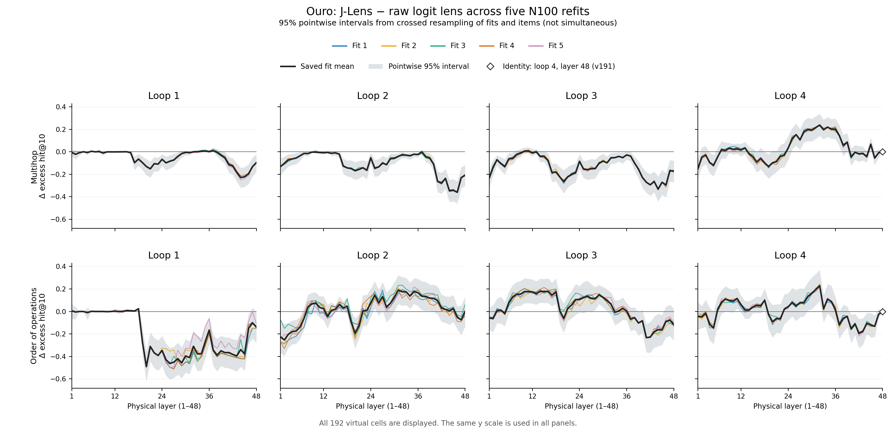

# Post-submission: independent Ouro refits and bounded follow-up

**9 September 2026, completed P1–P3 analyses.** Five independent Ouro N100 fits, target/position controls and the validated Huginn N100, R8 pilot have completed their evaluations. Root reviewed the analyses and reconciled independent numerical and provenance audits. The optional probe extension was not executed. The original application and September 7 artifacts remain unchanged.

The early multihop deficit survives all five fits and all tested target/position choices. The historically selected loop-4 band at layers 26–37 also survives independent main fitting: its mean J-Lens-minus-logit-lens excess hit@10 is **+0.1872**, positive in every fit, and every fit peaks at layer 32. The final-third mean is **+0.0613**, also positive in every main fit. Variation between these fitted estimators is small relative to uncertainty across evaluation items.

That stability does not extend to comparable magnitude and late-band sign across estimator choices. In the paired fit01 controls, sampled-sum fitting preserves the local multihop mean at **+0.1811**. The penultimate target reduces it to **+0.0445**, and diagonal fitting to **+0.0571**; their matched final-third averages become negative. These are conditional comparisons from one control fit. The main-minus-penultimate and sampled-sum-minus-diagonal local differences have positive pointwise intervals but do not clear the full simultaneous family.

The narrow calibration-fit question therefore has a favorable answer, while the broader late advantage is estimator-sensitive in these observed fits. There is no general loop-4 superiority: the main full-loop any-layer contrast is negative, and the five-fit simultaneous intervals for the positive bands include zero. Huginn provides no clear support for the predicted relative improvement: its J-Lens-minus-raw estimates are negative under all six fixed task/summary combinations, and every simultaneous cross-model interval includes zero. Ouro's training objective remains a possible explanation for the strong raw baseline, but target/position changes already explain part of the late recovery pattern. They do not rescue the early deficit or isolate supervision as its cause.

**Artifact loss:** the local watchdog terminated the worker before full retrieval, after incorrectly reopening an expired setup deadline. All saved evaluation ranks/caches and analysis inputs survived, but nine of sixteen expected estimator binaries were not recovered in full, including the Huginn bank. This limits independent fit-bank verification and future readouts; it does not prevent reproduction of the reported statistics from saved evaluations. The incident and surviving files are documented below.

## Five independent fits

The score is the paired difference in item excess hit@10: eligible own-name recovery minus matched-control recovery, for J-Lens minus the raw logit lens. Values below are proportions. “Any” applies each label's any-layer recovery event before averaging; the two loop-4 bands average fixed layers.

| Fit | Loop 1 any | Loop 2 any | Loop 3 any | Loop 4, layers 26–37 | Loop 4, layers 33–48 | Loop 4, layer 32 |
|---|---:|---:|---:|---:|---:|---:|
| 1 | −0.3646 | −0.4577 | −0.3941 | +0.1891 | +0.0619 | +0.2399 |
| 2 | −0.3638 | −0.4546 | −0.3927 | +0.1858 | +0.0602 | +0.2398 |
| 3 | −0.3570 | −0.4200 | −0.4107 | +0.1878 | +0.0618 | +0.2398 |
| 4 | −0.3524 | −0.4567 | −0.4065 | +0.1919 | +0.0641 | +0.2406 |
| 5 | −0.3699 | −0.4427 | −0.4201 | +0.1814 | +0.0585 | +0.2287 |

All five fits are positive at every layer from 26 through 37. The broader positive run from 24 through 39 also occurs in every fit; this is a descriptive location summary. Every learned-map peak is at physical layer 32, ranging from +0.2287 to +0.2406. That layer precedes the final third, which starts at 33. Layer 48 is the declared identity reference and is excluded from learned-peak selection; its zero difference remains in the historical final-third mean.

The fixed 26–37 band has sample fit SD **0.00394**, versus a mean of +0.18717. The final-third SD is **0.00209**, versus +0.06131. The layer-32 SD is **0.00509**. These are aggregate fit-to-fit summaries over the same items. Individual examples can vary substantially more.

The saved [cell curves](analysis/ouro_run01/main_cells.csv), [all fixed metrics](analysis/ouro_run01/main_metrics.csv) and [individual-fit metrics](analysis/ouro_run01/per_fit_metrics.csv) retain both tasks, all four loops and the full prespecified summaries. The [sealed report](analysis/ouro_run01/report.json) also contains every fit's 192-cell curve, own/control decomposition, tied peaks and positive runs. Its P1 statistics are exactly equal to the previously accepted main-only analysis.

[PDF figure](analysis/ouro_run01_curves/refit_layerwise_curves.pdf). Shading is pointwise, not simultaneous; the full-family uncertainty below governs selected-location claims. The figure only renders saved statistics and introduces no new scoring or selection.

## Item uncertainty remains material

The primary intervals cross resampling of five calibration fits with paired item resampling. “Simultaneous” covers the complete prespecified family, separately for 56 task/metric contrasts and 384 task/cell contrasts. The component sensitivity resamples groups connected by shared eligible concepts, retaining item weighting.

| Multihop contrast | Mean | Crossed fit/item pointwise 95% | Crossed fit/item simultaneous 95% | Crossed fit/component simultaneous 95% |
|---|---:|---|---|---|
| Loop 4, historically selected 26–37 | +0.1872 | [0.1096, 0.2699] | [−0.0086, 0.3829] | [−0.0749, 0.4492] |
| Loop 4, layers 33–48 | +0.0613 | [0.0201, 0.1043] | [−0.1345, 0.2571] | [−0.2008, 0.3234] |
| Loop 4 peak, layer 32 | +0.2377 | Selected peak: use family interval | [0.0072, 0.4683] | [−0.0914, 0.5669] |

The first two rows use the 56-metric family; the selected peak uses the 384-cell family. Layer 32 is the only positive multihop cell clearing the crossed fit/item simultaneous interval. No positive cell clears the component simultaneous interval. The bands' component pointwise intervals are positive—[0.1110, 0.2651] and [0.0191, 0.1046]—but neither band clears the full simultaneous family.

Thus calibration-fit variation is not the main obstacle for these positive aggregate estimates. Generalization across items and dependence assumptions remain less secure. There are only five fits, and the curated evaluation has no uniquely justified IID population model. The multihop component analysis has 64 components, largest 6/90 items; arithmetic has only 14, largest 10/51.

## Early losses and arithmetic

Multihop any-layer differences average **−0.3615, −0.4463 and −0.4048** in loops 1–3. Their simultaneous intervals remain negative under both crossed item and crossed component resampling. The component intervals are [−0.6236, −0.0995], [−0.7084, −0.1843] and [−0.6669, −0.1428].

This loss also appears without any-layer aggregation. Full-loop fixed-layer means are −0.0533, −0.1028 and −0.1301; middle-band means are −0.0715, −0.1115 and −0.1558. Each is negative in every fit, with negative pointwise item/component intervals. Their broad 56-metric simultaneous intervals include zero. The loop-2 grand mean is negative at all 48 layers, although individual fits have small positive exceptions at layers 9, 10 or 37. “Early loops lose” refers to these aggregate results, not every cell of every fit.

Loop 4 remains metric-dependent. Its multihop full-loop mean is +0.0289 with crossed pointwise interval [−0.0141, 0.0737], while its any-layer contrast is −0.0500 with [−0.1300, 0.0283]. Localized recovery does not imply broader any-layer coverage.

Arithmetic remains mixed. Full-loop means are −0.2156, +0.0206, +0.0329 and +0.0060. The loop-4 26–37 band is positive in every fit, mean +0.0868 and fit SD 0.00542, but its crossed pointwise interval includes zero [−0.0022, 0.1752]. Its final third is negative in every fit, mean −0.0626, with pointwise interval [−0.1198, −0.0086]. Neither clears the full metric-family interval. Some loop-2/3 regions are positive, with weaker evidence under shared-concept resampling. Fit variation is more material for some arithmetic summaries: loop-1 any-layer fit SD is 0.0752.

## Target and position sensitivity

The controls use the preselected main fit01 calibration paragraphs, not a fit chosen after evaluation. Dense final and dense penultimate fitting differ only in derivative target, with final normalization/unembedding held fixed. The position pair shares each sampled valid target position and all 2,048 derivative directions per paragraph: sampled-sum reduces over valid source positions, while diagonal retains the matching source position. Sampled-sum has the same matrix expectation as dense fitting; its finite-sample rank accuracy need not be identical. The dense-to-sampled comparison measures this additional sampling sensitivity.

All scores below are J-Lens-minus-raw excess hit@10 on matched learned support. Target comparisons exclude virtual 190–191 and use physical layers 33–46 for the final-third intersection. Position comparisons exclude identity 191 and use layers 33–47. This prevents unsupported target tails or identities from becoming evidence. The local 26–37 band is identical across comparisons and remains explicitly historical-selected.

| Multihop arm | Loop 1 fixed mean | Loop 2 fixed mean | Loop 3 fixed mean | Loop 4, 26–37 | Matched final-third mean |
|---|---:|---:|---:|---:|---:|
| Main, target support | −0.0533 | −0.1038 | −0.1286 | +0.1891 | +0.0714 |
| Penultimate target | −0.0530 | −0.0988 | −0.1291 | +0.0445 | −0.0941 |
| Main, position support | −0.0533 | −0.1038 | −0.1286 | +0.1891 | +0.0661 |
| Sampled-sum position | −0.0522 | −0.0985 | −0.1271 | +0.1811 | +0.0547 |
| Diagonal position | −0.0539 | −0.0962 | −0.1135 | +0.0571 | −0.0471 |

The observed local mean remains positive in all arms, but penultimate and diagonal estimates are much smaller and their pointwise intervals include zero. The positive run overlapping the historical band ends at layer 32, compared with 39 for main and sampled-sum. Descriptive multihop peaks move from 32 to 30 for penultimate and 29 for diagonal. No selected-peak pointwise inference is attached to these locations.

| Paired multihop difference | Mean | Item pointwise 95% | Component pointwise 95% | Component simultaneous 95% |
|---|---:|---|---|---|
| Main minus penultimate, local 26–37 | +0.1445 | [0.0907, 0.2000] | [0.0920, 0.2015] | [−0.0773, 0.3664] |
| Main minus penultimate, matched final third | +0.1656 | [0.1106, 0.2225] | [0.1094, 0.2282] | [−0.0563, 0.3874] |
| Sampled-sum minus diagonal, local 26–37 | +0.1240 | [0.0705, 0.1795] | [0.0638, 0.1881] | [−0.0979, 0.3458] |
| Sampled-sum minus diagonal, matched final third | +0.1019 | [0.0671, 0.1386] | [0.0624, 0.1463] | [−0.1200, 0.3237] |

These intervals condition on fit01 and the fitted controls. The separate P2 family contains 352 contrasts: eight paired comparisons, 22 fixed summaries and two tasks, with 10,000 item/component draws. All four rows also include zero under item simultaneous correction. P2 estimates no control fit variance. Its family differs from P1's five-fit family and does not replace that evidence. The main-minus-sampled local difference is only +0.0080, item pointwise interval [−0.0099, 0.0224]; this supports descriptive similarity, not an equivalence claim.

Early multihop fixed-loop averages remain negative for every arm, with negative pointwise item/component intervals, although their P2 simultaneous intervals include zero. Penultimate and diagonal loop 2 curves are negative at all 48 cells; main fit01 has three positive exceptions and sampled-sum one. This distinction preserves the separate P1 claim about the five-fit mean curve.

Arithmetic remains mixed. The penultimate target changes the local mean from +0.0821 to −0.0926 and the target-matched final-third mean from −0.0670 to −0.1950. Sampled-sum and diagonal local means are +0.0317 and +0.0427, both with pointwise intervals including zero; their matched final thirds remain negative. No broad arithmetic advantage follows.

The [complete control metrics](analysis/ouro_run01/control_metrics.csv), [paired item arrays](analysis/ouro_run01/paired_items.npz) and [independent P2 audit](analysis/ouro_run01_review/actual_p2_result_review.json) preserve all comparisons and uncertainty. The audit reconstructed rank scoring, denominators, aliases, controls, support, bootstrap membership and summaries, with maximum numerical discrepancy 1.23×10⁻¹⁵. Its 64 multihop and 14 arithmetic components retain equal item weighting through ratio means.

## Examples and checks against misleading positives

The frozen random sample contains ten eligible items, selected without reference to effects. A separate frozen sample includes five matcher-failure examples per task. All are retained in [examples.json](analysis/main_run01/examples.json), with per-fit metric values.

- The atomic-number-29 item answers “Cu” correctly. Its copper-label local-band contrast is +1.0 in every fit, while its loop-1 any-layer contrast is about −0.96.
- The Spain/Portugal item incorrectly answers “the Atlantic Ocean,” yet its local-band contrast is +0.9722 in every fit. Recovering an intermediate label does not establish that the model uses it to answer correctly.
- The basketball item answers 11 rather than 5. Its local-band contrast ranges from +0.3357 to +0.8357 across fits. The correctly answered spider item ranges from +0.2669 to +0.6027. Stable aggregate means do not guarantee stable item-level measurements.
- The correctly answered Amazon/Brazil item has essentially no local-band improvement. The arithmetic item `2 * 3 - 4 + 5` produces “Options:” and has a positive local-band gap but a negative final-third gap.

Failure labels use the frozen historical prefix matcher on the saved short continuations. They are not a fresh factual-error adjudication: for example, “the North Pole” fails the target `north` prefix rule. Historical and revised answer criteria are not mixed.

Independent reconstruction reproduced all item scores exactly and the bootstrap intervals within 1.6×10⁻¹⁵. The multihop local-band effect comprises +0.1891 own-name recovery and +0.0019 control recovery, yielding +0.1872 excess. It is not produced by reducing control hits. All five evaluated rank banks are distinct; the nearly equal fit-2/3 peak means contain differing item contributions that cancel. [Numerical audit](analysis/main_run01_review/actual_main_result_review.json); [distinct-fit audit](analysis/main_run01_review/actual_main_distinct_fit_review.json).

Root also inspected every frozen example under all target/position arms. The atomic-number-29 local contrast falls from +1.0 to +0.4106 with the penultimate target and +0.4167 with diagonal fitting, while sampled-sum stays at +1.0. But changes are not uniform: the Amazon item improves from −0.0036 to +0.4106 under penultimate fitting, and the Louvre item improves from +0.9167 to +1.0. The incorrectly answered rhyme-hive item improves strongly under diagonal fitting. These counterexamples rule out a claim that every item worsens or that recovery establishes correct causal use. All frozen example effects and own/control decompositions are retained in the P2 audit.

The sampled-sum multihop local gain is +0.1815 own-name difference minus +0.0004 control difference, yielding +0.1811 excess. Penultimate's local own/control differences are +0.0370/−0.0075, and diagonal's are +0.0565/−0.0006. The major attenuation reflects own-name recovery, not a changed control denominator.

## What this round adds

Each fit uses 100 independently sampled calibration paragraphs under the frozen recipe. Realized paragraph and declared input sets are disjoint; some source articles overlap. All five use the same new GPU/runtime configuration. Eligible evaluation denominators remain 90 multihop items/100 labels and 51 arithmetic items/51 labels. Labels are averaged within items, controls within eligible slots, and items equally within tasks. Historical alias/catalogue conventions are preserved, including the four multihop slots with alias-overlapping controls documented in the audit.

The original 16-hour application established the early multihop losses under its reported scoring. The September 7 follow-up analyzed the retained N100 outputs and localized the loop-4 positive region, with uncertainty conditional on one lens. This round establishes stability of that region across five independently sampled N100 fits under the new calibration policy, and demonstrates substantial target/position sensitivity of the late point estimates in a paired control fit. The historical run used a different calibration prefix and numerical configuration, so historical-to-new mean changes do not isolate sampling variation alone.

The analysis follows the [frozen contract](analysis/CONTRACT.md): 10,000 draws, paired item resampling shared across fits/methods, separate fit-only/item-only intervals and component sensitivity. The earlier P1-only wrapper allowed main results to be examined while controls ran. The complete P1/P2 analyzer has now passed and reproduces those P1 statistics exactly. Root accepted the actual control analysis after independent reconstruction and inspection. The [run log](RUN_LOG.md) records validation, failed attempts, transfers and interpretation changes; [CLAIMS.md](CLAIMS.md) states current verdicts.

## Huginn: no clear support for the predicted relative improvement

The validated N100, R8 Huginn pilot does not provide clear support for the recorded prediction. J-Lens has negative J-minus-raw estimates on both tasks under all three fixed summaries, in both evaluation seeds. Its relative margin over Ouro is small and positive for the multihop all-source mean and both seven-source means, negative for the arithmetic all-source mean, and negative for both any-of-seven comparisons. Every interval in the six-contrast simultaneous family includes zero. The directional prediction remains unresolved by this bounded pilot; a positive Huginn advantage has not been established.

The prediction, frozen before fitting, is unchanged:

> If J-Lens recovers content outside the native output basis, its advantage over raw logit lens should be larger in Huginn than in Ouro.

The comparison uses the preselected Ouro fit01 and one Huginn fit, each calibrated on the same 100 texts. Both Huginn evaluation initializations, 2026090803 and 2026090804, are retained and scored separately before averaging. They are two trajectories of one estimator, not independent fits. Joint tokenizer eligibility leaves **88 multihop items/98 slots** and **51 arithmetic items/51 slots**; the common catalogues contain 68 and 20 control names. Scores retain equal item weighting, within-item slot averaging, each slot's matched controls and historical aliases. These denominators differ from the Ouro-only P1/P2 population.

“Relative difference” below is `(Huginn J − Huginn raw) − (Ouro J − Ouro raw)`, in excess hit@10 proportions. The all-source mean uses all 32 learned Huginn core maps and 191 learned Ouro maps. The seven-source mean uses the fixed fractions 1/8 through 7/8 of each executed block sequence. Any-of-seven first computes each own/control name's recovery event over those seven cells, then averages; it does not select favorable cells or combine seeds into extra opportunities.

| Task and summary | Huginn J − raw | Ouro fit01 J − raw | Relative difference | Paired item pointwise 95% | Paired item simultaneous 95% |
|---|---:|---:|---:|---|---|
| Multihop, all learned sources | −0.0579 | −0.0648 | +0.0069 | [−0.0281, 0.0406] | [−0.1846, 0.1985] |
| Multihop, seven-source mean | −0.0662 | −0.0961 | +0.0299 | [−0.0278, 0.0835] | [−0.1616, 0.2215] |
| Multihop, any-of-seven | −0.1554 | −0.1207 | −0.0347 | [−0.1776, 0.1076] | [−0.2263, 0.1568] |
| Arithmetic, all learned sources | −0.0825 | −0.0507 | −0.0318 | [−0.1386, 0.0784] | [−0.2234, 0.1597] |
| Arithmetic, seven-source mean | −0.0514 | −0.0638 | +0.0124 | [−0.0573, 0.0802] | [−0.1792, 0.2039] |
| Arithmetic, any-of-seven | −0.1448 | +0.0196 | −0.1644 | [−0.3454, 0.0211] | [−0.3560, 0.0271] |

Each relative estimate has the same sign in both fixed seeds. The multihop all-source differences are +0.0098/+0.0041; arithmetic differences are −0.0312/−0.0324. This consistency does not estimate calibration-fit or general initial-state variance. The 10,000 paired bootstrap draws keep model, method, source and seed pairing intact. Shared-concept resampling has 62 multihop components and only 14 arithmetic components; all component simultaneous intervals also include zero. Arithmetic any-of-seven has a negative component pointwise interval [−0.3507, −0.0090], but its item pointwise and both full-family intervals include zero. That isolated interval does not establish a corrected negative cross-model result.

### Absolute recovery and the trained coda

Huginn J-Lens recovers few eligible names until the last pass. Its mean own recovery over all 32 sources is 0.0126 on multihop and 0.0135 on arithmetic. Raw readout gives 0.0803/0.4216 and the trained coda 0.1504/0.5052. Arithmetic also has substantial control-name recovery: its corresponding raw/coda control means are 0.3335/0.3982. Raw own hits alone therefore overstate its specificity.

| Task/readout | Any-of-seven own recovery | Matched-control recovery | Excess recovery |
|---|---:|---:|---:|
| Multihop, J-Lens | 0.0114 | 0.0053 | 0.0061 |
| Multihop, raw | 0.1818 | 0.0203 | 0.1615 |
| Multihop, trained coda | 0.3750 | 0.0914 | 0.2836 |
| Arithmetic, J-Lens | 0.0000 | 0.0008 | −0.0008 |
| Arithmetic, raw | 0.3529 | 0.2089 | 0.1440 |
| Arithmetic, trained coda | 0.6078 | 0.5090 | 0.0988 |

Coda-minus-raw mean excess over all sources is +0.0513 on multihop and +0.0190 on arithmetic. Yet arithmetic coda-minus-raw any-of-seven excess is −0.0452: the additional own recovery is accompanied by still more control recovery. The coda is not uniformly better under every recovery summary.

The physical-block pattern remains visible when all eight passes are averaged. J-Lens-minus-raw excess is negative at each of the four block types: multihop **−0.0425, −0.0671, −0.0660, −0.0559**; arithmetic **−0.0783, −0.1151, −0.1054, −0.0311**. For arithmetic, raw own recovery drops from 0.4681/0.5650/0.5502 at blocks 1–3 to 0.1029 at block 4. The coda gives 0.5147/0.5172/0.5025/0.4865, while J-Lens gives 0/0/0.0061/0.0478. Thus the block-4 raw-readout weakness appears here, but the averaged Jacobian map does not generally repair it.

There are local exceptions. At Huginn's final core source31, arithmetic J-Lens-minus-raw excess is +0.1109 and J-Lens-minus-coda is +0.0535; multihop J-minus-raw is +0.0167 but J-minus-coda is −0.1472. These are descriptive endpoint values, not selected peaks with certified intervals. Source31 is upstream of the coda and is not an identity map. The endpoint is excluded from the seven-opportunity comparison because Ouro's endpoint is a declared identity. Multihop J-minus-coda is negative at all 32 sources; arithmetic is negative at every source except31.

The [complete curves and own/control decompositions](analysis/huginn_run01/cells.csv), [six fixed comparisons](analysis/huginn_run01/metrics.csv), [native agreement](analysis/huginn_run01/native_agreement.csv) and [sealed report](analysis/huginn_run01/report.json) retain both seeds, all source cells, physical-block summaries and descriptive cell-mean distributions. The coda applies its normalization and both attention-bearing blocks to the complete sequence. Its pass-end readouts are native recurrence exits; within-pass coda readouts are interventions. It has extra nonlinear computation and is trained after sampled recurrence depths. Huginn therefore does not have “no intermediate supervision.”

Native next-token agreement gives a separate diagnostic. Across the first seven pass exits, Huginn J-Lens agrees with the same-source coda on 0–1.14% of multihop items and 0% of arithmetic items. The native coda trajectories generally agree more with the final native prediction at later pass exits, with reversals; their final-source agreement is 100% by construction. These comparisons use token identities within each model. They do not measure whole-answer correctness or compare vocabularies.

### Examples and interpretation

Root inspected all ten frozen random examples and the ten frozen readout-failure examples. The failure rule is a missing own-label hit in the seven-cell grid in both Huginn trajectories; it covers 87/88 eligible multihop items and all 51 arithmetic items. This is concept-readout failure, not a claim that Huginn answered those questions incorrectly.

In the random armistice example, the coda recovers `war` on the grid in both seeds while raw and J-Lens do not. In the photosynthesis example, raw recovers `oxygen` while both other readouts miss it. J-Lens recovers `Italy` in the Colosseum example at a source outside the seven-cell grid, so a grid miss does not imply no recovery anywhere. In `(2 + 3) * 4`, coda and raw both recover the intermediate `5` somewhere on the grid and J-Lens does not; the coda's greater control recovery makes its any-of-seven excess lower than raw for this item. The 20 selected prompts and labels, with seed-specific own/control metrics, are retained in [examples.json](analysis/huginn_run01/examples.json).

Some apparently favorable relative differences require particular care. In the random arithmetic examples with intermediate `12`, none of the Huginn readouts recovers the own label. J-Lens can nevertheless have a positive all-source contrast because it also recovers fewer controls. Such a margin is not evidence of newly recovered intermediate content. Individual trajectories also differ: raw grid recovery of `down` in the roots example changes from a miss to a hit between seeds while the coda hits in both. These observations limit both a blanket failure claim and a favorable interpretation of isolated margins.

The independent numerical audit reconstructed all 135 retained fields, all 2,304 cell rows, six metric rows and 1,152 native-agreement rows, with maximum discrepancy 1.11×10⁻¹⁶. It checked aliases, sentinels, own/control denominators, item pairing, source support, the item and component bootstrap schemes, seed averaging and the frozen example selections. The main analyzer separately validated both tensor caches and their semantic seals. [Independent audit](analysis/huginn_run01_review/actual_huginn_result_review.json).

Matched calibration texts and a common scoring population make this a useful comparison, but not an isolated supervision experiment. The models differ in width, training, tokenization, target computation and executed depth; equal source counts do not equate compute or semantic depth. The intervals condition on one estimator per model and two fixed Huginn trajectories. We do not know whether another Huginn calibration fit or recurrence depth would change the result. This pilot supplies no clear confirmation of the proposed relative readout advantage and no causal evidence about Ouro's training objective.

## Huginn validation and fit provenance

The native implementation and measured budget gates passed before fitting at 11:55:56 UTC on September 9. All 34 virtual states and final logits matched the native execution bitwise, and all 892,108,800 full-width Jacobian entries matched the native reference in the gate. These checks covered gradient-capable recurrence, shared initial state across derivative replicas, extracted recurrent blocks, and the coda's normalization and attention. Frozen eligibility and calibration/evaluation separation were checked independently. [Gate receipts](monitoring/attempt_06/20260909T115652Z/COPY_VERIFIED.json).

The surviving checkpoint metadata contains all 100 calibration diagnostic rows. Each records the full 32-source/target33 derivative calculation, B8 and 660 backward passes; all 100 initialization records match the frozen metadata. Recorded compute times range from 119.51 to 121.50 seconds per paragraph, mean 120.75 seconds, excluding accumulation and checkpoint I/O. These retained diagnostics do not provide per-paragraph native-parity tests, GPU peak memory or independent matrix checksums. The preflight parity measurement should not be read as a parity test on every calibration paragraph.

Both fixed evaluation seeds completed and passed the worker's semantic checks by 15:33:02 UTC. Before the later termination, a separate verified handoff preserved all 22 required Huginn evaluation/provenance files, including both tensor caches. Root rehashed that handoff and reconciled its embedded fit/runtime identities against the accepted gates and Ouro prerequisites. Independent review subsequently authenticated the surviving actual fit owner, completion, checkpoint pointer, checkpoint seal, metadata and run identity. [Provenance audit](analysis/huginn_run01_review/actual_huginn_provenance_review.json); [surviving-fit audit](analysis/huginn_run01_review/actual_huginn_surviving_fit_review.json).

The evaluator records that the FP16 bank equals the FP32 checkpoint sum divided by 100 under the prescribed conversion. That remains a producer validation assertion. The full Huginn checkpoint and final bank were not recovered, so root cannot independently repeat that numerical check locally. Fit metadata acceptance and complete evaluation acceptance do not establish complete estimator-binary acceptance.

## Retrieval failure and stopping point

The experiment completed, but full artifact preservation failed. Around 15:43 UTC, the local watcher selected “setup did not finish within the bounded window” despite a previously recorded complete status with setup_complete=true. Its pinned source checks only the current status and lacks a persistent record of successful setup. A later missing status can therefore reopen the expired setup deadline, which is tested before the successful-retrieval branch. The retained state and control flow strongly indicate that path here. The exact failed SSH response was not captured, and the ordering of the connection reset versus the deletion request is unknown. The recorded termination reason was neither the budget limit nor successful retrieval.

Three provider absence confirmations completed at 15:44:51 UTC; root's subsequent read-only account check found no owned worker. The controller's conservative combined spending upper bound was **$13.8518**, below the $25 cap; this is not a settled invoice. No new worker was started. The [incident audit](monitoring/attempt_06/termination_incident/attempt06_termination_incident_review.json) retains the source pins, terminal state, retrieval failure and limitations of the causal reconstruction.

The interrupted main retrieval directory contains 57 files totaling 24,181,744,065 bytes. Seven complete estimator binaries total 22,406,447,319 bytes: both control checkpoints and banks, Ouro fit01's checkpoint and bank, and Ouro fit02's checkpoint. Nine expected estimator binaries are not complete locally: Ouro fit02's final bank, both checkpoint and bank for fits03–05, and both Huginn binaries. Huginn's checkpoint is truncated at 1,745,780,736 of 3,568,444,419 bytes; its final bank and final metadata/seal are absent. Older orphan partials remain preserved separately and are not counted as complete banks.

Root hashed all 57 retrieved files and rechecked all 127 files consumed by the accepted numerical audit. The saved evaluation inputs and analysis outputs still match. The [surviving-artifact manifest](monitoring/attempt_06/termination_incident/SURVIVING_ARTIFACTS.json) distinguishes complete, partial, absent and initially unbound files. A [supplementary binding audit](monitoring/attempt_06/termination_incident/attempt06_surviving_manifest_review.json) authenticates three initially unbound files through earlier receipts or deterministic serialization; only the setup log remains without an independent prior binding. The expected-file set comes from earlier verified records, not a complete final remote inventory, which was never retained. There is no final RETRIEVAL_VERIFIED receipt. Reproducing the reported statistics from saved evaluations remains possible; new readouts and full independent binary verification are unavailable for the missing banks.

A separate [prospective controller correction](monitoring/attempt_06/controller_correction/lease_setup_latch_README.md) persists the first validated setup completion for the exact lease and pod. Seven focused synthetic cases exercised the actual watcher and local state locks, including restart followed by SSH failure, unfinished setup, wrong identity and later verified retrieval. Root reconciled the [independent review](monitoring/attempt_06/controller_correction/lease_setup_latch_review.json) and accepted the patch and proof. It has not been deployed; historical controller copies remain unchanged, and the patch does not recover lost bytes.

This is a scientifically useful stopping point with documented operational loss. The five-fit result supports local calibration stability, the paired controls expose estimator sensitivity, and Huginn supplies no clear confirmation of the relative-improvement prediction. Ouro supervision remains a viable explanation for its strong raw baseline, alongside target choice, position reduction, architecture and model-specific representation geometry. None is causally isolated. Readability remains separate from use, and this round did not test a monitoring advantage.

## Optional supervised probe

The optional operand-pair probe extension passed the prospective time/cost gate under a 900-second total GPU cap. Automatic approval review blocked its upload/execution/retrieval because it did not recognize the recovered prior authorization. No fresh approval arrived by the stated 11:35 UTC cutoff, so root left P4 unexecuted and released the existing worker into Huginn's gates before its waiting window expired. No remote P4 work occurred and there is no scientific result. We do not know whether more training pairs close the probe gap.
